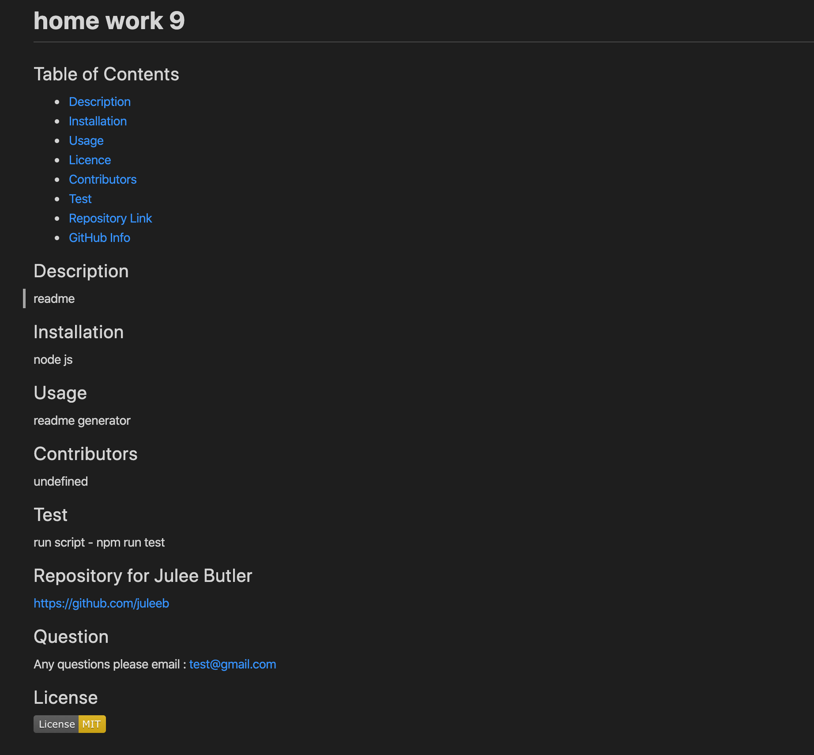
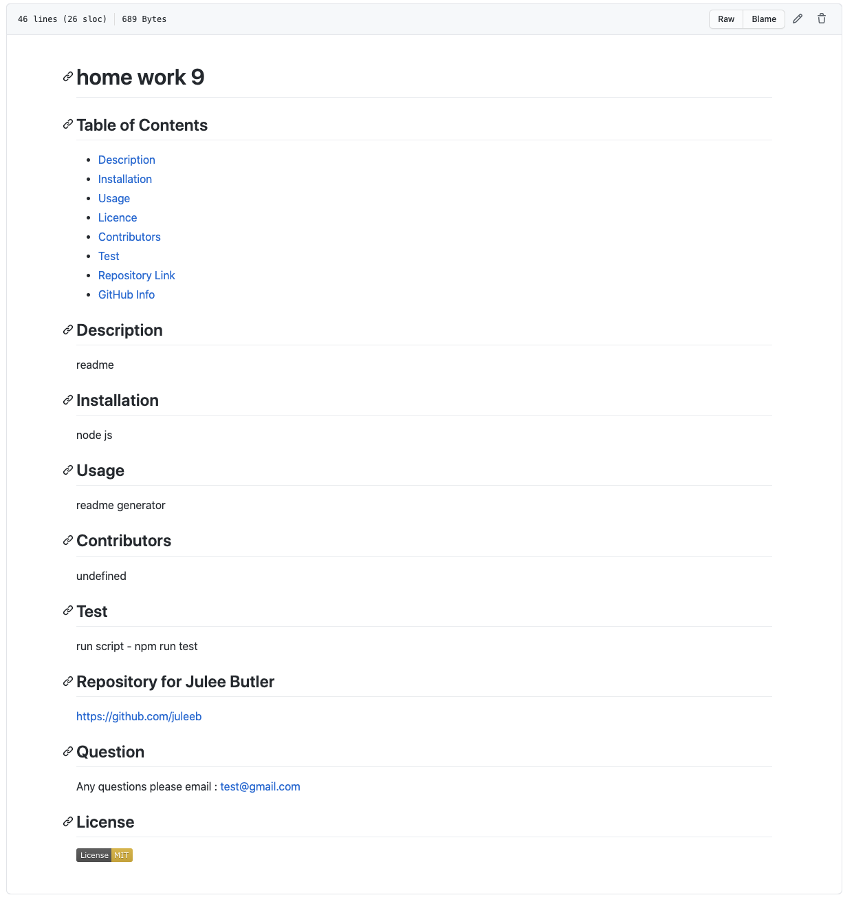

# readme-generator
About the project:

Command-line README generator for Github.

Image preview:

-Functionality of the application on terminal

-Final product on README.md file on Visual Studio Code in Preview

-Final product on README.md on Github

Description of project:

-Javascript

-NPM:

    -axios
    -inquirer

-ES6+

Deployed Link:

https://juleeb.github.io/readme-generator/

